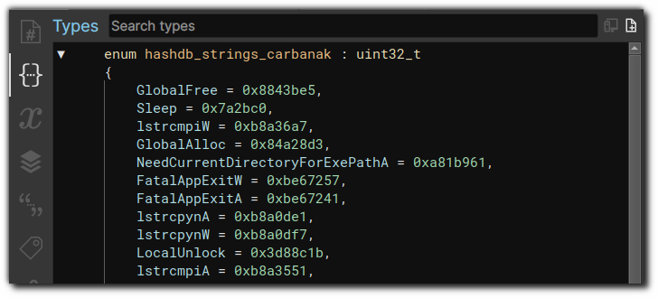
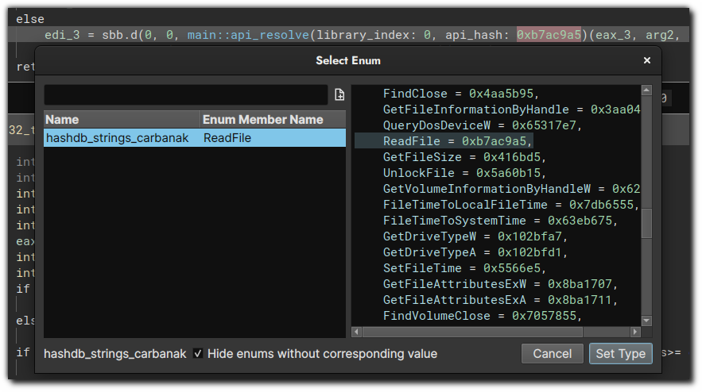

# Binary Ninja HashDB Plugin

[HashDB](https://github.com/OALabs/hashdb) is a community-sourced library of hashing algorithms used in malware. This plugin queries the [OALabs HashDB Lookup Service](https://hashdb.openanalysis.net/) for hash values which appear in the currently analyzed file, fetches a list of strings which match those hashes, and collects the string values into a type definition (e.g. an enum). The defined type can then be applied to the binary for further analysis.

## Usage

### Viewing and applying found hashes

Found hashes are added as enum entries under the `hashdb_strings` enum type, and can be viewed in the _Types_ menu. The resolved hash string is set as the name of the enum entry.

All newly found hashes are appended as enum entries to this type.

The enum type can then be applied to variables in the database.

If you are using Binary Ninja >= 3.3, you can also apply the resolved hash names using the new _Select Enum_ dialog (accessible by pressing the `M` key, or through _Display as_ > _Enum Member_ in the context menu).

The name of the enum type created (by default `hashdb_strings`) can be changed in Binary Ninja's settings, under _HashDB > HashDB Enum Name_.

### Keyboard shortcuts

Keyboard shortcuts can be set for this plugin's commands from Binary Ninja's Keybindings interface (_Edit > Preferences > Keybindings_). The command list can be filtered to show only the HashDB plugin's commands by searching `HashDB` in the Keybindings search box.

The plugin currently does not ship with any keyboard shortcuts set by default.

## Installation

This plugin can be installed via either:

1) (Available soon) Binary Ninja's built-in plugin manager (_Plugins > Manage Plugins_).

2) Cloning this repository into your user plugins folder.
    - The [location of the user plugins folder will vary depending on the platform Binary Ninja is installed on](https://docs.binary.ninja/guide/index.html#user-folder). The easiest way to find the location of the folder is via the _Plugins > Open Plugin Folder..._ command.
    - If you are performing an installation via this method, you must also install this plugin's Python dependencies manually. This can be done by either:
        - Running the _Install python3 module..._ command (via the Command Palette), and pasting the contents of [`requirements.txt`](requirements.txt) in this repository into the dialog window.
        - Running `pip install -r requirements.txt` in the Python environment used by Binary Ninja.

## License

This plugin is released under a 3-Clause BSD license.

This plugin is a derivative work of the [IDA Plugin](https://github.com/OALabs/hashdb-ida/) from [OALabs](https://oalabs.openanalysis.net/) for connecting to their [HashDB service](https://hashdb.openanalysis.net/), and is forked from Vector 35's initial implementation at [psifertex/hashdb-bn](https://github.com/psifertex/hashdb-bn).